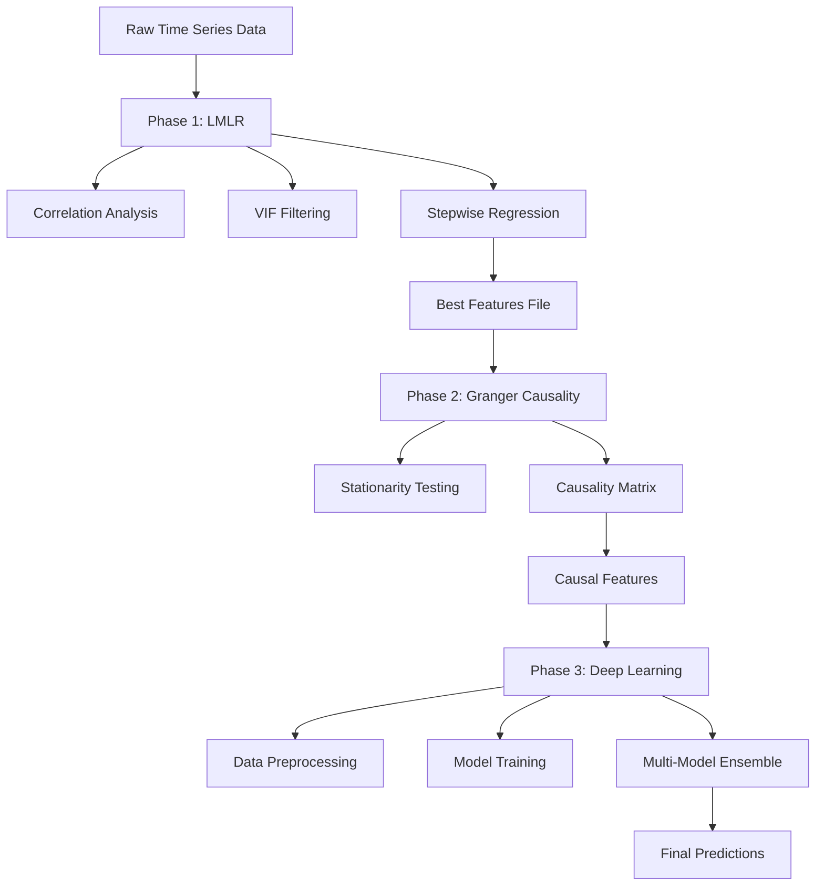

# CCLR-PREDAP Documentation

Welcome to the **CCLR-PREDAP** (Comprehensive Cross-Correlation and Lagged Linear Regression for Predictive Analytics) documentation. This framework provides a hybrid approach combining statistical models and deep learning for feature selection and time series forecasting.

## 🎯 What is CCLR-PREDAP?

CCLR-PREDAP is a three-phase pipeline designed for high-dimensional time series analysis:

1. **Phase 1 - Lagged Multiple Linear Regression (LMLR)**: Feature selection using correlation analysis, VIF filtering, and stepwise regression
2. **Phase 2 - Granger Causality Testing**: Statistical validation of causal relationships between predictors and target
3. **Phase 3 - Deep Learning Forecasting**: Advanced neural network models for multi-horizon prediction

## 🌟 Key Features

- **Comprehensive Feature Selection**: Reduces dimensionality while preserving predictive power
- **Statistical Validation**: Ensures selected features have causal relationships with targets
- **Multiple Deep Learning Models**: Support for GRU, LSTM, BiLSTM, CNN-LSTM, and more
- **Healthcare Focus**: Specifically designed for healthcare demand forecasting
- **Modular Architecture**: Each phase can be used independently or as part of the complete pipeline

## 🔬 Research Background

This methodology is based on the research described in:

> Guillem Hernández Guillamet, Francesc López Seguí, Josep Vidal Alaball, Beatriz López. **CCLR-DL: A novel statistics and deep learning hybrid method for feature selection and forecasting healthcare demand**, Computer Methods and Programs in Biomedicine, Volume 272, 2025, 109057.

## 🚀 Quick Start

```python
import pandas as pd
from src.lmlr import models_training, get_top_correlations_blog
from src.gcausal import granger_causation_matrix, select_causal_features
from src.dl import create_model_lstm, fit_model, prediction

# Load your time series data
df = pd.read_csv('your_data.csv', index_col=0)

# Phase 1: Feature Selection with LMLR
correlations = get_top_correlations_blog(df, threshold=0.90)
best_features = models_training(df, target_col='your_target', ...)

# Phase 2: Granger Causality Testing
causality_matrix = granger_causation_matrix(df, df.columns, p=7)
causal_features = select_causal_features(causality_matrix, 'your_target')

# Phase 3: Deep Learning Forecasting
model = create_model_lstm(X_train)
trained_model = fit_model(model, X_train, y_train, epochs=100)
predictions = prediction(trained_model, X_test)
```

## 📊 Use Cases

- **Healthcare Demand Forecasting**: Predict patient visits and resource utilization
- **Financial Time Series**: Stock prices, market indicators, economic forecasting
- **Industrial IoT**: Sensor data analysis and predictive maintenance  
- **Environmental Monitoring**: Weather patterns and climate modeling

## 🏗️ Architecture



## 📚 Documentation Structure

- **[Getting Started](getting-started/installation.md)**: Installation, setup, and basic configuration
- **[User Guide](user-guide/overview.md)**: Detailed explanation of each phase and methodology
- **[API Reference](api/lmlr.md)**: Complete function and class documentation
- **[Examples](examples/basic-usage.md)**: Practical examples and use cases
- **[Development](development/contributing.md)**: Contributing guidelines and development setup

## 🤝 Contributing

We welcome contributions! Please see our [Contributing Guide](development/contributing.md) for details on how to:

- Report bugs and issues
- Suggest new features
- Submit pull requests
- Improve documentation

## 📄 License

This project is licensed under the Apache 2.0 License. See the [License](about/license.md) page for details.

## 📞 Support

- **Issues**: [GitHub Issues](https://github.com/your-organization/CCLR_PREDAP/issues)
- **Email**: guillemhg98@gmail.com
- **Documentation**: This documentation site

---

*Built with ❤️ for the research and healthcare communities*