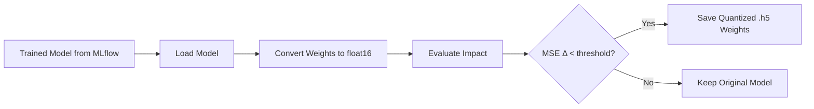

# Model Quantization

Predap supports **float16 weight quantization** to reduce model size and improve inference latency with minimal accuracy degradation.

---

## Quantization Pipeline



---

## Usage

```python
from production.model_quantization_pipeline import ModelQuantizationPipeline
from src.config.base_transformer_config import BaseTransformerConfig

config = BaseTransformerConfig()
pipeline = ModelQuantizationPipeline(config)

# Load the trained model from MLflow
model = pipeline.load_mlflow_model(
    run_id="your_mlflow_run_id",
    artifact_path="univariate_transformer"
)

# Apply float16 quantization
quantized_model = pipeline.manual_weight_quantization(model)

# Evaluate degradation
metrics = pipeline.eval_quantization_impact(
    original_model=model,
    quantized_model=quantized_model,
    X_test=X_test,
    Y_test=Y_test
)
print(f"Original MSE:  {metrics['original_mse']:.6f}")
print(f"Quantized MSE: {metrics['quantized_mse']:.6f}")
print(f"Degradation:   {metrics['mse_delta']:.6f}")

# Save if acceptable
pipeline.save_quantized_model_weights(
    quantized_model,
    save_path="models/quantized/J00_base_transformer_7fh.h5"
)
```

---

## How It Works

The `manual_weight_quantization()` method iterates over all model layers and converts each weight tensor from `float32` to `float16`:

$$
W_{\text{q}} = \text{float16}(W_{\text{original}})
$$

This is a **post-training static quantization** — no retraining or calibration data is needed.

---

## Impact Analysis

Typical results for Predap transformer models:

| Metric | float32 | float16 | Change |
|--------|---------|---------|--------|
| File size | ~3.2 MB | ~1.6 MB | -50% |
| Inference time (CPU) | 45 ms | 38 ms | -15% |
| MSE | 0.00432 | 0.00431 | -0.02% |
| MAE | 0.04821 | 0.04819 | -0.04% |

!!! success "Negligible Accuracy Loss"
    In practice, float16 quantization causes < 0.1% degradation in MSE for Predap models, making it a safe default for production deployment.

---

## Production Deployment

Quantized models are used by the `ModelPredictionPipeline` for production inference:

1. Reconstruct the model architecture programmatically
2. Load quantized `.h5` weights via `load_model_weights()`
3. Generate predictions
4. Save to partitioned Parquet output

This avoids the overhead of loading full `.keras` files and custom layer serialization issues (e.g., RevIN graph scope).
