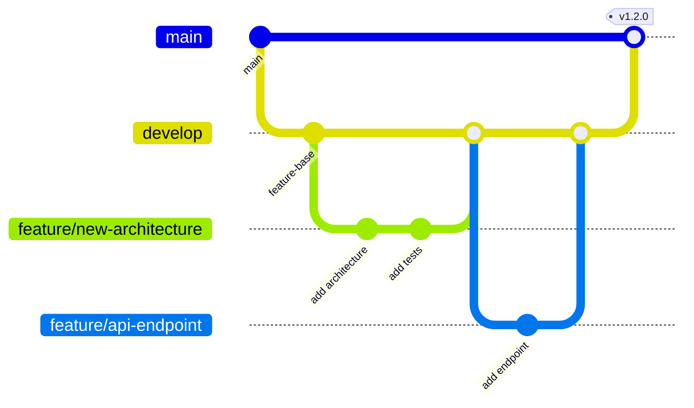

# Contributing

We welcome contributions to the Predap project! This guide explains the development workflow and coding standards.

---

## Development Setup

```bash
# Clone the repository
git clone https://github.com/IASOM/PREDAP.git
cd predap/TRANSFORMERS_PREDAP

# Create a virtual environment
python -m venv .venv
source .venv/bin/activate

# Install dependencies
pip install -r requirements.txt

# Install development tools
pip install black flake8 pytest
```

---

## Code Style

We use **Black** for formatting and **Flake8** for linting:

```bash
# Format code
black src/ api/ production/ --line-length 120

# Lint
flake8 src/ api/ production/ --max-line-length 120
```

### Conventions

- **Docstrings**: Google-style (parsed by `mkdocstrings`)
- **Type hints**: Use `typing` annotations for all public function signatures
- **Config classes**: Use `@dataclass` with `__post_init__` validation
- **Pipeline classes**: Follow the `Config → Pipeline → Outputs` pattern
- **Model naming**: Use structured filenames (see [Configuration Reference](../user-guide/configuration.md#model-name-generation))

---

## Branch Strategy



| Branch | Purpose |
|--------|---------|
| `main` | Production-ready releases |
| `develop` | Integration branch for features |
| `feature/*` | Individual feature development |
| `hotfix/*` | Critical production fixes |

---

## Pull Request Process

1. **Create a feature branch** from `develop`
2. **Implement changes** with tests and documentation
3. **Run formatting and linting**: `black . && flake8 .`
4. **Run tests**: `pytest tests/`
5. **Submit PR** to `develop` with a clear description
6. **Code review** — at least one approval required
7. **Merge** via squash merge

---

## Adding a New Model Architecture

1. Create `src/univariate_transformer/transformer_architechtures/model_architecture_{name}.py`
2. Implement `build_{name}_model(input_shape, head_size, num_heads, ff_dim, ...)` following the existing interface
3. Register in `build_model()` dispatcher in `model_architecture_univ_transformer.py`
4. Add tests
5. Document in the [Univariate Transformer API](../api-reference/python/univariate-transformer.md)

---

## Adding a New API Endpoint

1. Create/update router in `api/routers/`
2. Add Pydantic request/response schemas in `api/schemas/`
3. Include the router in `api/main.py`
4. Document in the [REST API Reference](../api-reference/rest-api.md)

---

## Project Layout Guide

| Directory | Purpose | When to modify |
|-----------|---------|----------------|
| `src/config/` | Configuration dataclasses | Adding new parameters |
| `src/utils/` | Data prep, evaluation, experiments | Changing data pipelines |
| `src/univariate_transformer/` | Phase 1 model code | New architectures, training changes |
| `src/residual_multivariate_transformers/` | Phases 2 & 3 | Residual model changes |
| `src/main_train_*_class.py` | Pipeline orchestration | Modifying training flow |
| `api/` | REST API | New endpoints |
| `production/` | Production pipelines | Deployment changes |
| `conf/` | Hydra YAML configs | New experiment configurations |
| `docs/` | Documentation | Always update with code changes |
