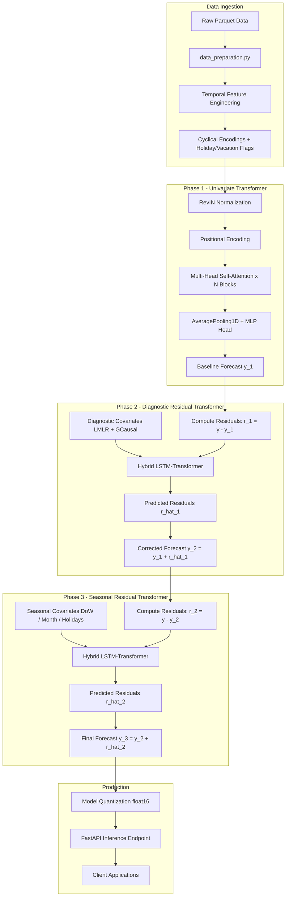
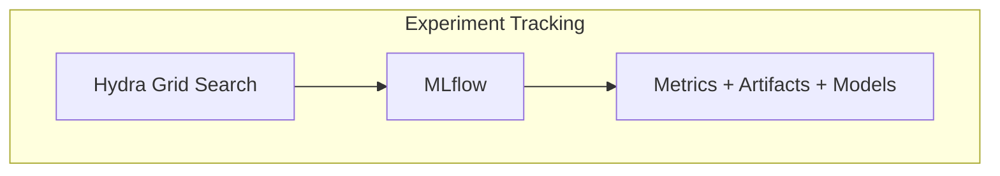

RUMIA HealthTech Documentation

# Predap — Healthcare Demand Forecasting

Predap is a deep learning ecosystem for forecasting diagnostic visit demand in healthcare systems. It uses a three-phase Transformer-based residual correction pipeline with production-ready inference capabilities via FastAPI.

[Installation](getting-started/installation.md){ .md-button .md-button--primary }
[Quickstart](getting-started/quickstart.md){ .md-button }
[API Reference](api-reference/rest-api.md){ .md-button }

## What Predap Delivers

### Reliable Forecasting

High-accuracy multi-horizon predictions with a transparent residual correction pipeline.

- 1 to 365 days ahead
- Structured experiment tracking
- Production-ready inference

### Designed for Teams

Clear navigation, calm layouts, and documentation patterns that support technical reading.

- FastAPI deployment
- Hydra experiments
- MkDocs Material base

## Architecture Overview

## Experiment Tracking

## Three-Phase Pipeline Summary

| Phase | Pipeline Class | Input | Output |
|-------|---------------|-------|--------|
| **1. Univariate** | `UnivariateTransformerPipeline` | Target time series + temporal features | Baseline forecast $\hat{y}_1$ |
| **2. Diagnostic Residual** | `DiagnosticResidualTransformerPipeline` | Residuals $r_1$ + diagnostic covariates | Corrected forecast $\hat{y}_2 = \hat{y}_1 + \hat{r}_1$ |
| **3. Seasonal Residual** | `SeasonalResidualTransformerPipeline` | Residuals $r_2$ + seasonal covariates | Final forecast $\hat{y}_3 = \hat{y}_2 + \hat{r}_2$ |

## Key Capabilities

- **Accurate multi-horizon forecasts** of healthcare diagnostic visits from 1 to 365 days ahead
- **Three-phase residual correction** that progressively refines predictions from baseline to seasonal enrichment
- **Production-ready deployment** with quantized models, FastAPI endpoints, and automated data ingestion
- **Experiment tracking** with MLflow and Hydra-based grid search
- **COVID-aware logic** built around pandemic wave handling and the Catalan public health calendar

## Quick Links

[Installation](getting-started/installation.md){ .md-button .md-button--primary }
[5-Minute Quickstart](getting-started/quickstart.md){ .md-button }
[API Reference](api-reference/rest-api.md){ .md-button }
