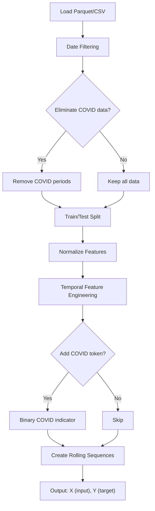

# Data Preprocessing

Predap provides a comprehensive data ingestion and feature engineering pipeline in `src/utils/data_preparation.py`. <br>
This module handles: 

1- raw data loading<br>
2- date filtering<br>
3- normalization<br>
4- COVID period handling<br>
5- temporal feature engineering<br>
6- rolling sequence creation<br>

---

## Pipeline Overview



---

## Entry Point: `prepare_data()`

The main function that orchestrates the full pipeline:

```python
from src.utils.data_preparation import prepare_data

X_train, Y_train = prepare_data(
    csv_file="data/full_CAT1.parquet",
    code="J00",              # Target diagnostic code column
    lookback=14,             # Days of history as input
    forecast=7,              # Days ahead to predict
    cutoff_date="2008-01-01",
    max_date="2025-09-30",
    covid_token=True,
    train=True,              # True=training split, False=test split
    univariate=True,
    scaler=MinMaxScaler(),
)
# X_train shape: (n_samples, lookback, n_features)
# Y_train shape: (n_samples, forecast)
```

---

## Date Filtering

The `cut_dataframe()` function trims data to a specific date range. This is critical for ensuring sufficient training history while excluding future data:

```python
df_filtered = cut_dataframe(
    df,
    date_cutoff="2008-01-01",   # Start date
    max_date="2025-09-30",       # End date
    csv_file="data.parquet",
    save_data=False
)
```

---

## COVID Period Handling

Predap supports two COVID-related strategies, both configurable via `BaseTransformerConfig`:

### 1. COVID Token Feature

A binary indicator column (`covid_token`) flags whether each date falls within a predefined pandemic period. The covid periods are indicated with a one and non covid periods with a 0. This allows the model to learn pandemic-specific patterns without removing data:

```python
df = add_covid_token(df)
# Adds column: covid_token ∈ {0, 1}
```

### 2. COVID Data Elimination

Alternatively, you can remove COVID-period rows entirely to prevent pandemic outlier contamination during training:

```python
df = eliminate_covid_dates(df, covid_periods=[
    ("2020-03-01", "2020-06-30"),
    ("2020-10-01", "2021-03-31"),
    # ... additional waves
])
```

The five **Catalan pandemic waves** are pre-configured in `BaseTransformerConfig.PANDEMIC_WAVES`:

| Wave | Start | End |
|------|-------|-----|
| Primera Onada | 2020-03-01 | 2020-06-21 |
| Segona Onada | 2020-06-22 | 2020-12-06 |
| Tercera Onada | 2020-12-07 | 2021-03-14 |
| Quarta Onada | 2021-03-15 | 2021-06-20 |
| Cinquena Onada | 2021-06-21 | 2022-03-31 |

---

## Normalization

Train/test data is normalized using scikit-learn scalers (default: `MinMaxScaler`). The target code column uses a **cloned scaler** to allow independent inverse transformation of predictions:

```python
train_df_norm, test_df_norm = normalize_dataframe(
    train_df, test_df,
    csv_file="data.parquet",
    save_data=False,
    target_code="J00",
    scaler=MinMaxScaler()
)
```

The inverse transform is essential for evaluating predictions on the original scale:

```python
predictions_original = inverse_transform_predictions(
    predictions, original_scale_df, code="J00",
    lookback=14, forecast=7
)
```

---

## Temporal Feature Engineering

`prepare_time_series_features()` creates the feature set that accompanies the target variable. All temporal features use **cyclical (sin/cos) encoding** to preserve periodicity:

| Feature | Encoding | Dimensions |
|---------|----------|-----------|
| Day of Week | $\sin(2\pi \cdot \text{dow}/7)$, $\cos(2\pi \cdot \text{dow}/7)$ | 2 |
| Month | $\sin(2\pi \cdot \text{month}/12)$, $\cos(2\pi \cdot \text{month}/12)$ | 2 |
| Day of Year | $\sin(2\pi \cdot \text{doy}/365)$, $\cos(2\pi \cdot \text{doy}/365)$ | 2 |
| Holiday | Binary (Catalan calendar via `holidays` library) | 1 |
| School Vacation | Binary (Catalan academic calendar) | 1 |
| Weekend | Binary (Saturday/Sunday) | 1 |
| Season | One-hot or cyclical | 2–4 |
| COVID Token | Binary pandemic period indicator | 1 |

The cyclical encoding formula for a periodic feature $x$ with period $P$:

$$
f_{\sin}(x) = \sin\left(\frac{2\pi \cdot x}{P}\right), \quad f_{\cos}(x) = \cos\left(\frac{2\pi \cdot x}{P}\right)
$$

This ensures that values at the boundary (e.g., Dec–Jan or Sat–Mon) are close in feature space.

---

## Rolling Sequence Creation

After feature engineering, the data is transformed into supervised learning sequences using a sliding window approach:

```
For lookback=14, forecast=7:

Time step:     [t-13, t-12, ..., t-1, t]  →  [t+1, t+2, ..., t+7]
               ├─── Input (X) ───────────┤     ├─── Target (Y) ──┤
               14 × n_features                  7 values
```

For **multivariate residual models** (Phases 2 & 3), `generate_rolling_sequences_covariates()` creates sequences that include covariate columns alongside the residual signal. Covariates are time-shifted by `forecast` steps using `shift_covariates()` to prevent future data leakage.

---

## Data Format Requirements

### Input Data (Parquet/CSV)

| Column | Type | Description |
|--------|------|-------------|
| `timestamp` | `datetime64` | Date index |
| `{code}` | `float64` | Target demand values (one column per diagnostic code) |
| Additional columns | `float64` | Optional covariate features |

### Diagnostic Covariates (Excel)

Files named `BEST_features_NOSMOOTH_{CODE}.xlsx` with columns:

| Column | Description |
|--------|-------------|
| `LAG` | Forecast horizon value |
| `predictors` | Comma-separated list of selected feature column names |

These files are generated by the upstream LMLR + Granger-Causal feature selection pipeline.
