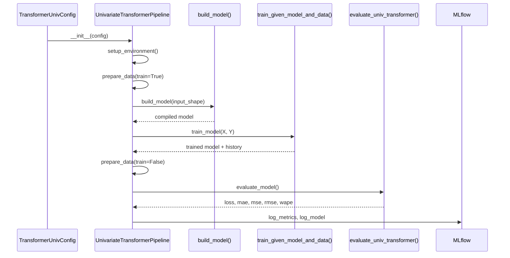
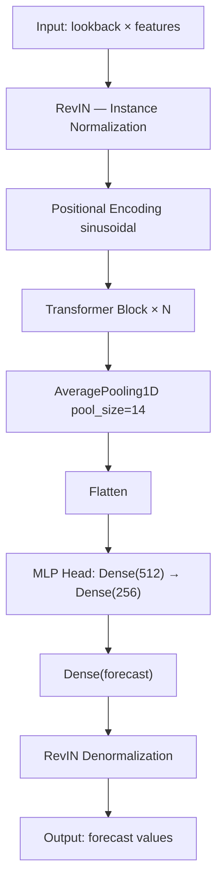

# Model Training

Predap trains models through a **three-phase residual correction pipeline**. Each phase is implemented as a self-contained pipeline class with configuration, training, and evaluation stages.

---

## Training Architecture



---

## Phase 1: Univariate Transformer

The baseline forecast is produced by a standard Transformer encoder applied to the univariate target series plus temporal features.

### Model Architecture



**Transformer Block internals:**

Each block consists of:

1. **Multi-Head Self-Attention** — `head_size × num_heads` with dropout
2. **Layer Normalization** + residual connection
3. **Feed-Forward Network** — `Dense(ff_dim) → activation → Dense(features)` with dropout
4. **Layer Normalization** + residual connection

### Pipeline Usage

```python
from src.main_train_univ_transformer_class import (
    TransformerUnivConfig,
    UnivariateTransformerPipeline,
)

config = TransformerUnivConfig(
    lookback=14,
    forecast=7,
    code="J00",
    activation_function="gelu",
    covid_token=True,
    cutoff_date="2008-01-01",
    head_size=32,
    num_heads=8,
    ff_dim=512,
    mlp_units=[512, 256],
    learning_rate=1e-5,
    batch_size=256,
    data_path="data/full_CAT1.parquet",
)

pipeline = UnivariateTransformerPipeline(config)
outputs = pipeline.run_complete_pipeline()
```

### Output Object: `UnivariateTransformerPipelineOutputs`

| Field | Type | Description |
|-------|------|-------------|
| `model` | `tf.keras.Model` | Trained Keras model |
| `model_name` | `str` | Generated filename (e.g., `J00_base_transformer_7fh_512ff_14lb_1e-05lr.keras`) |
| `train_predictions` | `np.ndarray` | Training set predictions |
| `test_predictions` | `np.ndarray` | Test set predictions |
| `loss` | `float` | Test loss |
| `mae` | `float` | Mean Absolute Error |
| `mse` | `float` | Mean Squared Error |
| `rmse` | `float` | Root Mean Squared Error |
| `wape` | `float` | Weighted Absolute Percentage Error |

---

## Phase 2: Diagnostic Residual Transformer

After the univariate model produces baseline predictions $\hat{y}_1$, the residuals $r_1 = y - \hat{y}_1$ are modeled using diagnostic covariates selected by the upstream LMLR + Granger-Causal pipeline.

### Architecture

The residual model uses a **Transformer** design:

```
RevIN → Dense Projection → Positional Encoding → Transformer Encoder × N
→ AveragePooling1D(14) → Flatten → MLP → Dense(forecast) → RevIN Denorm
```

### Pipeline Usage

```python
from src.main_train_diagnostic_residual_transformer_class import (
    DiagnosticResidualTransformerConfig,
    DiagnosticResidualTransformerPipeline,
)

config = DiagnosticResidualTransformerConfig(
    lookback=14,
    forecast=7,
    code="J00",
    activation_function="gelu",
    covid_token=True,
    cutoff_date="2008-01-01",
    predictions_train_corrected=None,  # Uses univariate predictions
    predictions_test_corrected=None,
    head_size=32,
    num_heads=8,
    ff_dim=512,
    mlp_units=[512, 256],
    learning_rate=1e-4,
    batch_size=256,
    data_path="data/full_CAT1.parquet",
)

pipeline = DiagnosticResidualTransformerPipeline(config)
outputs = pipeline.run_complete_pipeline()

# Corrected predictions: ŷ₂ = ŷ₁ + r̂₁
corrected_predictions = outputs.predictions_test_corrected
```

---

## Phase 3: Seasonal Residual Transformer

The final phase models remaining residuals $r_2 = y - \hat{y}_2$ using categorical/seasonal covariates:

- **Day of Week** (cyclical sin/cos)
- **Month** (cyclical sin/cos)
- **Season** (cyclical encoding)
- **Holiday** (binary, Catalan calendar)
- **School Vacation** (binary)
- **Is Weekend** (binary)

```python
from src.main_train_seasonal_residual_transformer_class import (
    SeasonalResidualTransformerConfig,
    SeasonalResidualTransformerPipeline,
)

config = SeasonalResidualTransformerConfig(
    lookback=14,
    forecast=7,
    code="J00",
    activation_function="gelu",
    covid_token=True,
    cutoff_date="2008-01-01",
    predictions_train_corrected=diagnostic_outputs.predictions_train_corrected,
    predictions_test_corrected=diagnostic_outputs.predictions_test_corrected,
    batch_size=256,
)

pipeline = SeasonalResidualTransformerPipeline(config)
outputs = pipeline.run_complete_pipeline()
# Final forecast: ŷ₃ = ŷ₂ + r̂₂
```

---

## Learning Rate Schedule

All models use `CustomCosineDecay` — a linear warmup followed by cosine annealing:

$$
\eta(t) = \begin{cases}
\eta_{\min} + (\eta_{\max} - \eta_{\min}) \cdot \frac{t}{T_w} & \text{if } t < T_w \\[6pt]
\eta_{\min} + \frac{1}{2}(\eta_{\max} - \eta_{\min})\left(1 + \cos\left(\frac{\pi(t - T_w)}{T - T_w}\right)\right) & \text{if } t \geq T_w
\end{cases}
$$

Where:

- $\eta_{\max} = \text{learning\_rate} \times \text{lr\_max\_multiplier}$
- $\eta_{\min} = \text{learning\_rate} \times \text{lr\_min\_multiplier}$
- $T_w = \text{total\_steps} \times \text{lr\_warmup\_ratio}$

Default configuration: `lr_max_multiplier=100`, `lr_min_multiplier=10`, `lr_warmup_ratio=0.2`.

---

## Custom Layers

### RevIN (Reversible Instance Normalization)

Normalizes per-instance at model input and denormalizes at output, handling distribution shift in non-stationary time series:

$$
\hat{x} = \frac{x - \mu_x}{\sigma_x + \epsilon}, \quad \tilde{y} = \hat{y} \cdot \sigma_x + \mu_x
$$

### PositionalEncoding (Sinusoidal)

Injects position information using fixed sinusoidal patterns:

$$
PE_{(pos, 2i)} = \sin\left(\frac{pos}{10000^{2i/d}}\right), \quad PE_{(pos, 2i+1)} = \cos\left(\frac{pos}{10000^{2i/d}}\right)
$$

---

## Training Callbacks

| Callback | Purpose | Default |
|----------|---------|---------|
| `EarlyStopping` | Stops training when `val_loss` stops improving | `patience=50`, `restore_best_weights=True` |
| `CustomCosineDecay` | Learning rate schedule (warmup + cosine annealing) | See LR schedule above |

---

## Model Naming Convention

Models are saved as `.keras` files with structured names:

```
{code}_base_transformer_{forecast}fh_{ff_dim}ff_{lookback}lb_{lr}lr.keras
{code}_DIAGNOSTIC_RESIDUALS_LEARNING_{forecast}fh_{lookback}lb.keras
{code}_SEASONAL_RESIDUALS_LEARNING_{forecast}fh_{lookback}lb.keras
```

---

## Alternative Architectures

Switch between architectures by modifying the `build_model()` call:

| Architecture | Builder | Use Case |
|-------------|---------|----------|
| Base Transformer | `build_base_model()` | Default — best general performance |
| Informer | `build_informer_model()` | Memory-efficient Long sequences (lookback > 60) |
| LogSparse | `build_log_transformer_model()` | Memory-efficient attention |
| LSTNet | `build_lstnet_model()` | Sequential pattern emphasis |
